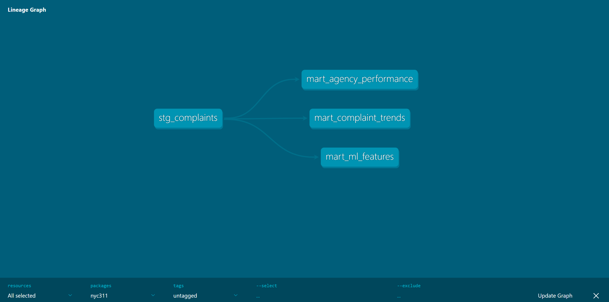
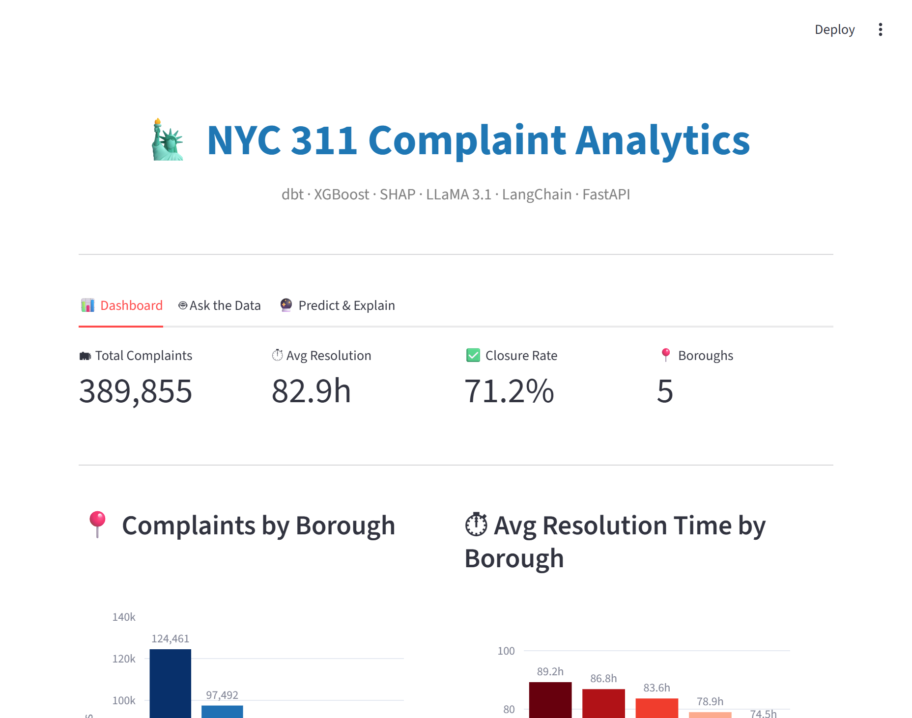
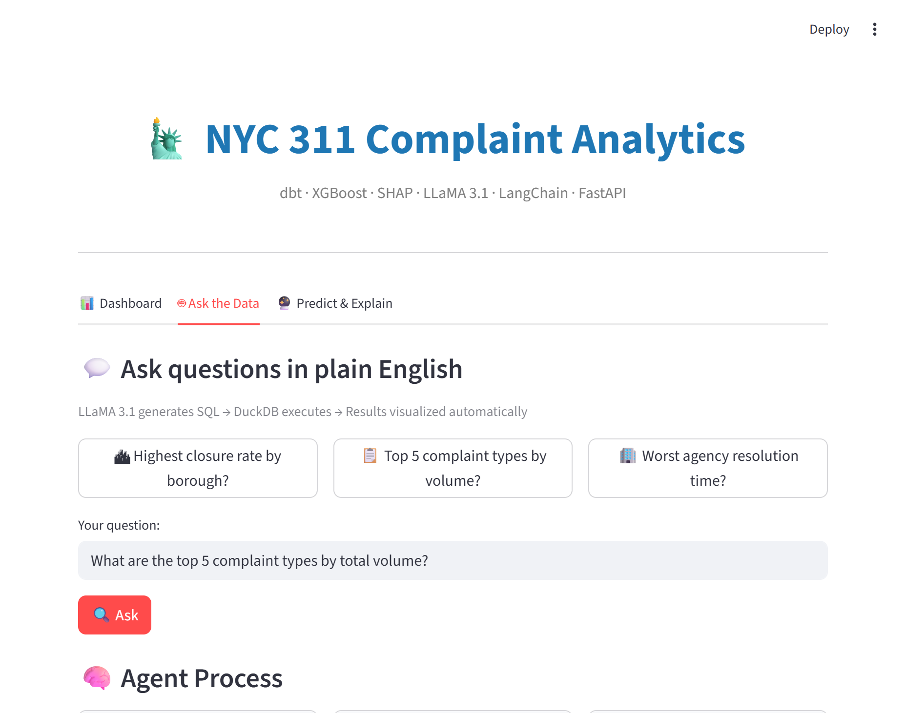
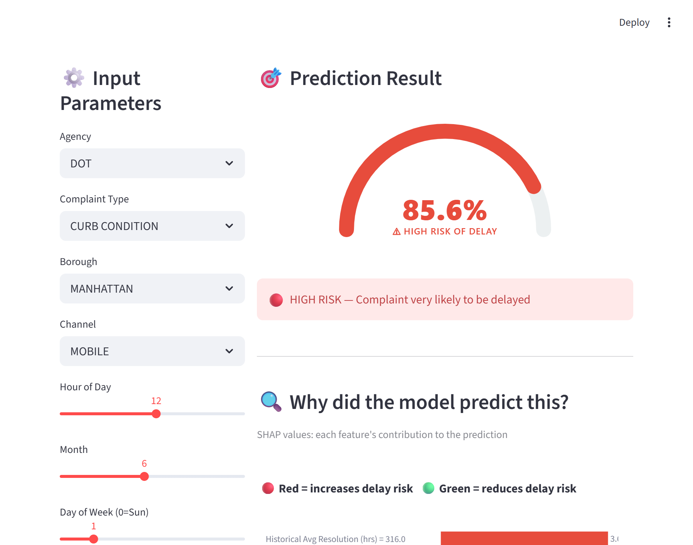
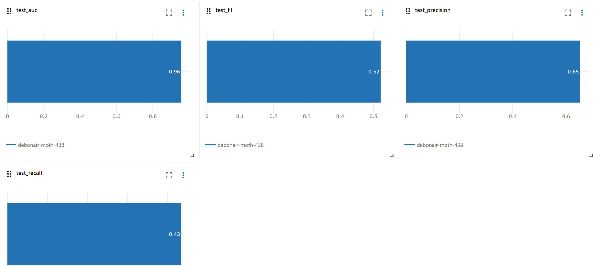
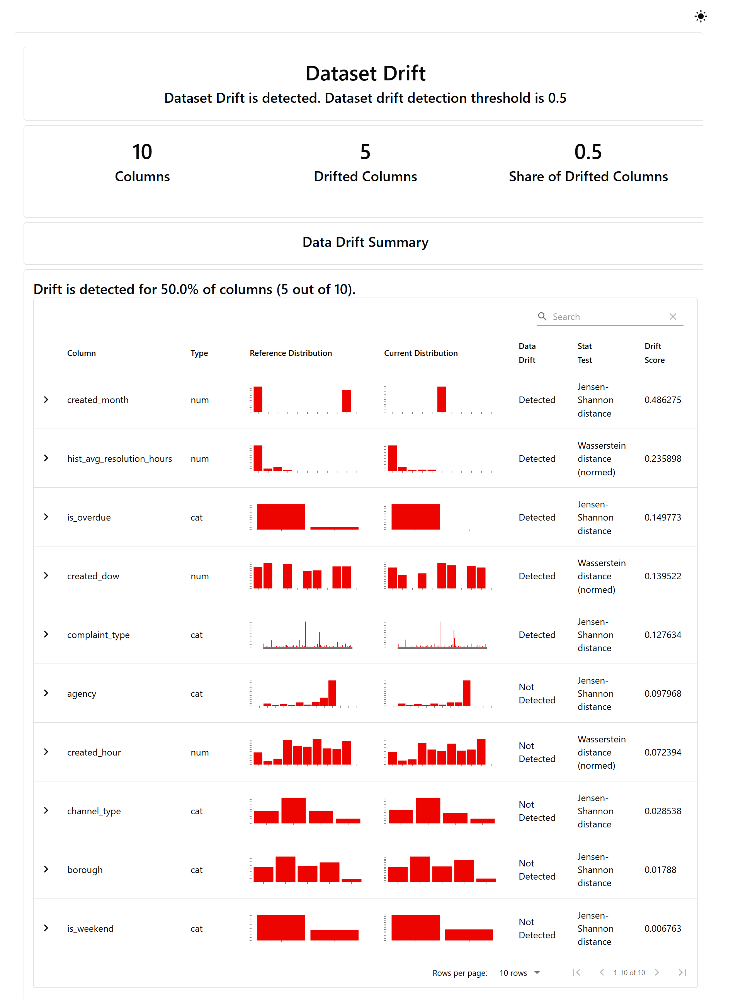
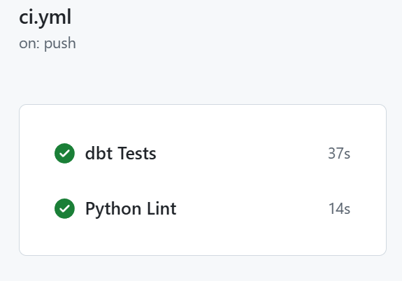

# 🗽 NYC 311 Complaint Analytics Platform

An end-to-end AI-augmented analytics platform built on NYC 311 service request data (390K+ records). Predicts complaint resolution delays, explains model decisions with SHAP, and enables natural language querying via an LLM-powered Text-to-SQL agent.


---

## 🏗 Architecture

```
Raw Data (NYC Open Data API)
        ↓
  [Prefect Orchestration]
        ↓
  [DuckDB + dbt Core]          ← Staging + 3 Mart models
   ↙            ↘
[XGBoost ML]   [LLM Text-to-SQL]
  MLflow          RAG (ChromaDB)
  Evidently       LangChain + Groq
   ↘            ↙
   [FastAPI Backend]
        ↓
 [Streamlit Dashboard]
```

## ✨ Features

### 📊 Tab 1 — Analytics Dashboard

- KPI metrics: total complaints, avg resolution time, closure rate
- Borough and agency performance comparisons
- Weekly complaint volume trend (area chart)
- Agency performance scatter plot (resolution time vs % over 1 week)

### 🤖 Tab 2 — Ask the Data (LLM Agent)

- Natural language → SQL via LLaMA 3.1 (Groq API)
- **RAG-enhanced**: ChromaDB vector store with schema docs and example queries for accurate SQL generation
- Step-by-step agent process visualization (question → SQL → results)
- Auto-visualization: bar charts generated from query results
- Input validation and SQL injection prevention

### 🔮 Tab 3 — Predict & Explain

- Predicts whether a complaint will exceed 1-week resolution (is_overdue)
- XGBoost classifier · **AUC = 0.96** · trained on 330K complaints
- Animated arc gauge showing overdue probability
- **SHAP waterfall chart**: explains each feature's contribution to the prediction
- Overall model feature importance visualization

---

## 🛠 Tech Stack

| Layer               | Tools                                    |
| ------------------- | ---------------------------------------- |
| Data Warehouse      | DuckDB                                   |
| Data Transformation | dbt Core (staging → marts)               |
| Orchestration       | Prefect                                  |
| ML Training         | XGBoost · Optuna (hyperparameter tuning) |
| Experiment Tracking | MLflow                                   |
| Model Monitoring    | Evidently AI (data drift detection)      |
| LLM                 | LLaMA 3.1 via Groq API                   |
| RAG                 | ChromaDB · sentence-transformers         |
| LLM Framework       | LangChain                                |
| Backend API         | FastAPI · slowapi (rate limiting)        |
| Frontend            | Streamlit · Plotly                       |
| Containerization    | Docker · docker-compose                  |
| CI/CD               | GitHub Actions (dbt tests + ruff lint)   |

---

## 📁 Project Structure

```
nyc311-analytics/
├── .github/workflows/
│   └── ci.yml                  # GitHub Actions CI pipeline
├── dbt_project/nyc311/
│   └── models/
│       ├── staging/
│       │   └── stg_complaints.sql
│       └── marts/
│           ├── mart_complaint_trends.sql
│           ├── mart_agency_performance.sql
│           └── mart_ml_features.sql
├── ml_pipeline/
│   ├── train.py                # XGBoost + Optuna + MLflow
│   └── monitor.py              # Evidently drift detection
├── api/
│   ├── main.py                 # FastAPI endpoints
│   └── llm/
│       ├── text_to_sql.py      # LLM query generation
│       └── rag.py              # ChromaDB vector store
├── scripts/
│   └── download_data.py
├── streamlit_app.py
├── Dockerfile
└── docker-compose.yml
```

---

## 🚀 Quick Start

### Prerequisites

- Python 3.12+
- [Groq API key](https://console.groq.com) (free)

### 1. Clone and install

```bash
git clone https://github.com/jfan4926/nyc311-analytics.git
cd nyc311-analytics

python -m venv venv
source venv/bin/activate  # Windows: venv\Scripts\activate

pip install -r requirements.txt
```

### 2. Configure environment

```bash
cp .env.example .env
# Add your GROQ_API_KEY to .env
```

### 3. Download data and run dbt

```bash
python scripts/download_data.py

cd dbt_project/nyc311
dbt run --profiles-dir .
dbt test --profiles-dir .
cd ../..
```

### 4. Train the model

```bash
python ml_pipeline/train.py
```

### 5. Build RAG knowledge base

```bash
python api/llm/rag.py
```

### 6. Start services

```bash
# Terminal 1 — FastAPI
python -m uvicorn api.main:app --reload

# Terminal 2 — Streamlit
python -m streamlit run streamlit_app.py
```

Open `http://localhost:8501`

### Docker (alternative)

```bash
docker-compose up --build
```

---

## 📊 Model Performance

| Metric    | Value    |
| --------- | -------- |
| AUC-ROC   | **0.96** |
| Precision | 0.65     |
| Recall    | 0.42     |
| F1        | 0.51     |

> **Note on class imbalance**: ~15% of complaints are overdue (positive class). AUC of 0.96 indicates strong ranking ability. F1/Recall are lower due to class imbalance — addressable with threshold tuning or class weighting based on business requirements.

---

## 🔍 dbt Data Lineage



---

## 📸 Screenshots

### Dashboard



### AI Agent (Text-to-SQL)



### Predict & Explain



### MLflow Experiment Tracking



### Evidently Drift Report



### CI/CD Pipeline



---

## 🔄 CI/CD

GitHub Actions runs on every push to `main`:

- **dbt Tests**: downloads sample data, runs all dbt models and data quality tests
- **Python Lint**: ruff linting across `ml_pipeline/` and `api/`

---

## 💡 Design Decisions

**Why DuckDB over Postgres/Snowflake?**
DuckDB is columnar, requires no server, and handles 390K rows in milliseconds locally. The dbt project is designed to be cloud-portable — switching to BigQuery or Snowflake requires only a profile change.

**Why RAG for Text-to-SQL?**
Without context, LLMs generate incorrect SQL for aggregated tables (e.g. forgetting `GROUP BY` on weekly mart data). RAG injects relevant schema descriptions and example queries, significantly improving accuracy.

**Why XGBoost over deep learning?**
Tabular data with mixed feature types. XGBoost provides strong baseline performance, native feature importance, and SHAP compatibility for explainability — critical for stakeholder trust.

---

## 📋 Agile Process

Managed with GitHub Projects (Kanban) and GitHub Issues across 4 sprints:

| Sprint   | Focus                  | Status  |
| -------- | ---------------------- | ------- |
| Sprint 1 | Data Engineering (dbt) | ✅ Done |
| Sprint 2 | ML Pipeline            | ✅ Done |
| Sprint 3 | LLM + API + UI         | ✅ Done |
| Sprint 4 | RAG + CI/CD            | ✅ Done |

---

## 🤖 Built With Assistance

Developed with [Claude](https://claude.ai) (Anthropic) as an AI pair programmer.

## 📄 License

MIT
